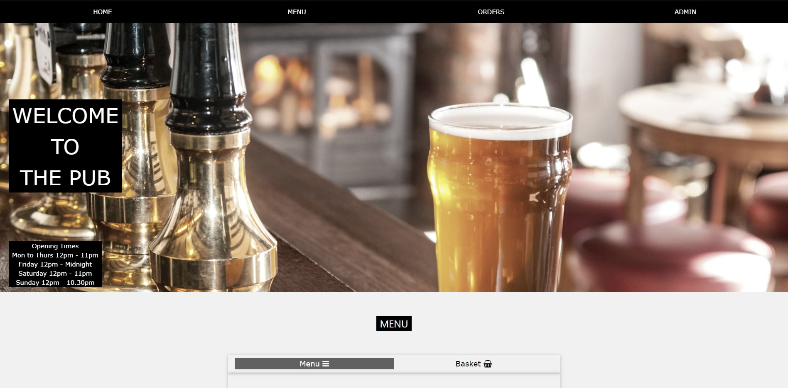
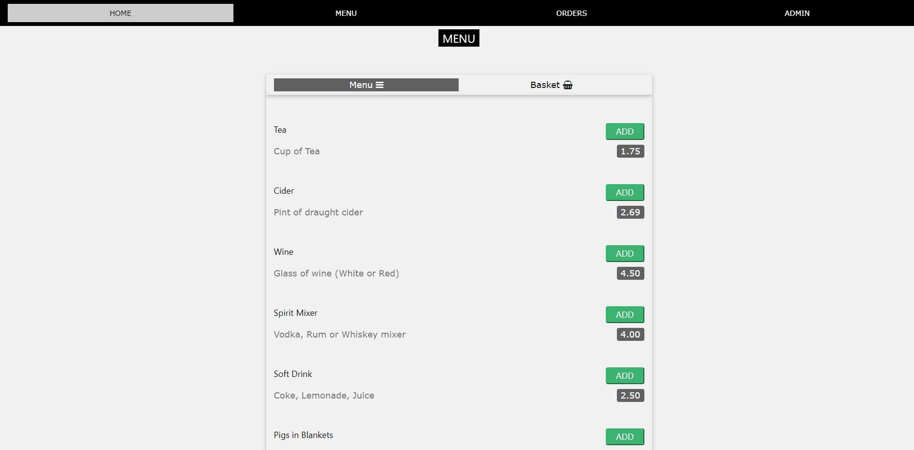
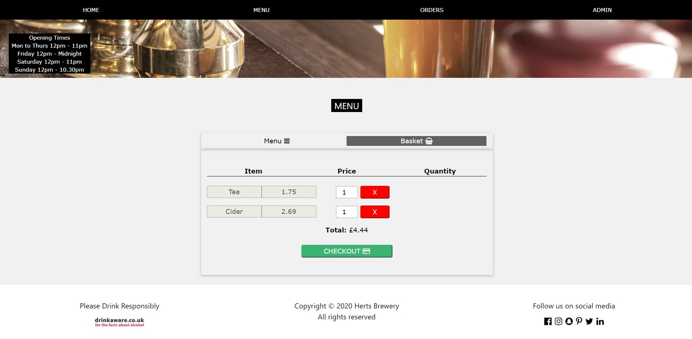
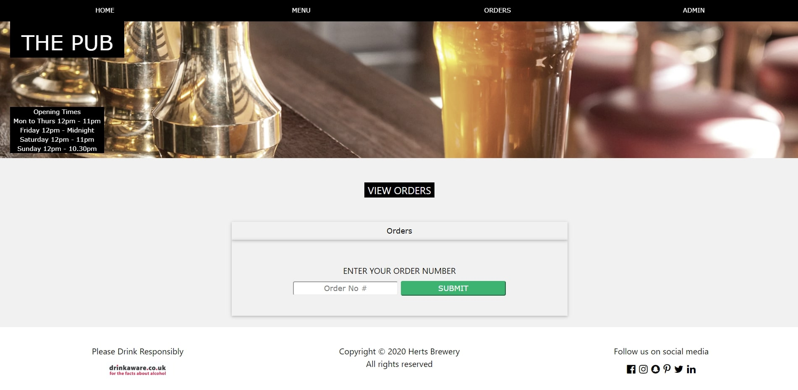
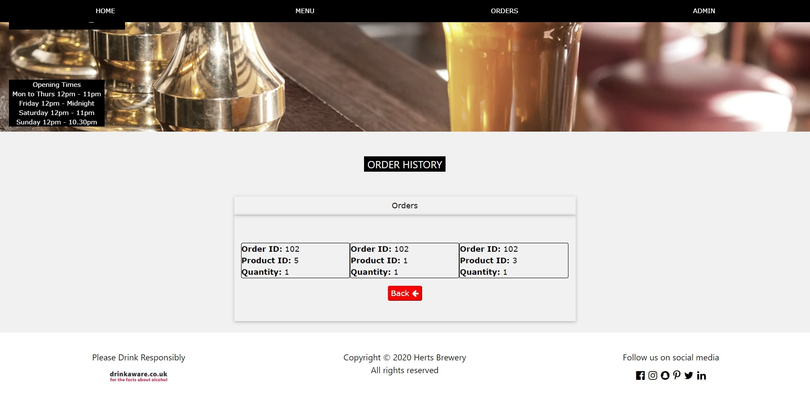
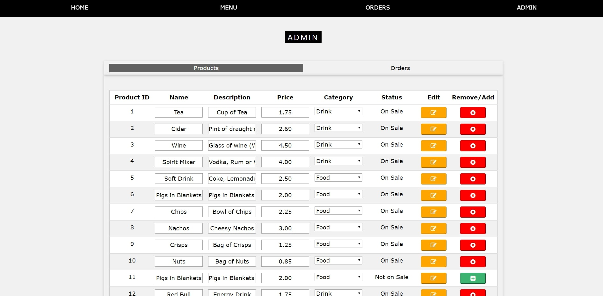
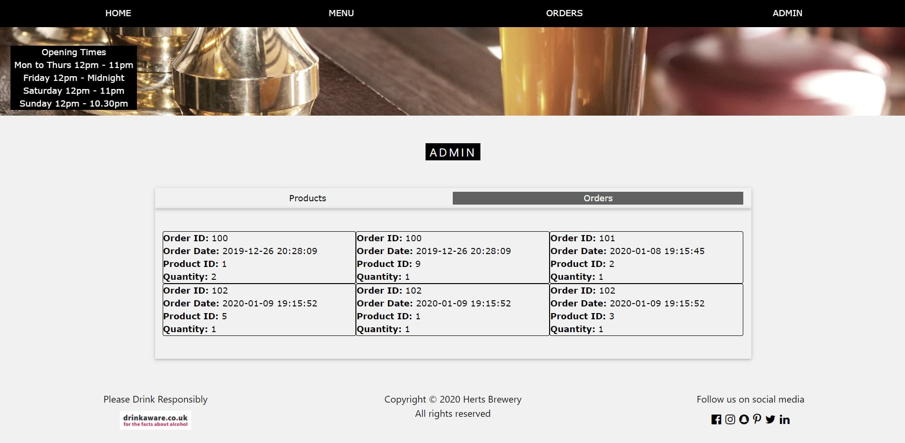
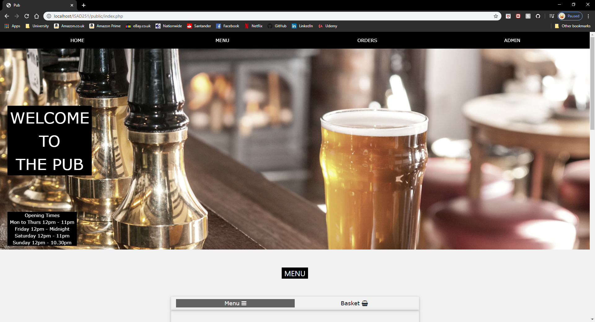
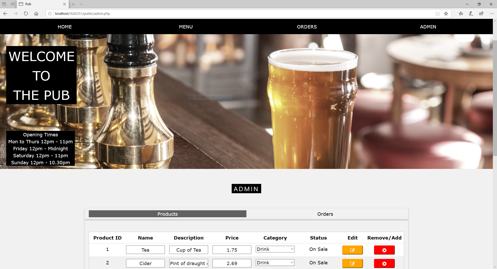

<h1>ISAD251</h1>  

 My Repository for demonstrating ISAD251 database application development
        
Welcome to the repository for a pub ordering application. This application is designed to allow customers to order items from a menu and staff to see what customers have ordered and edit a menu for items that are on sale.

<h3>Functionality</h3>
<h4>The functionality are as follows:</h4>

<ul>
        <li>As a customer I wish to see what I have ordered.</li>
        <li>As the admin I wish to enter details of the drinks/snacks I have for sale.</li>
        <li>As the admin I wish to read the details of the drinks/snacks I have for sale.</li>
        <li>As the admin I wish to view a customer’s order(s)</li>
        <li>As the admin I wish to edit the details of the drinks/snacks I have for sale.</li>
        <li>As the admin I wish to withdraw a drink/snack from sale.</li>
</ul>

<h3>User Guide</h3>
<h4>Customer</h4>
<strong>Menu and Basket:</strong>
Firstly the customer is taken to the menu on the home page of the application. From here a customer can add an item to their basket by pressing the add button next to an item. The item will then be placed in the customers basket on the next tab of called 'Basket' next to the menu tab at the top. NOTE: An item can only be added once through the add button and quantity must be adjusted in the basket.

        

In the basket the customer can increase/decrease the quantity of an item or remove this item from the basket. After this the customer will push the checkout button and the order would be placed. Unfortunately, due to time contraints and lack of understanding, the order will not be placed and pushed to database at this time.

<strong>Viewing an order:</strong>
As a customer you can review your order by going to the orders page using the top navigation bar and selecting 'Orders'. From here a customer can place their order number into the text box and press submit. After this they are redirected to another page displaying their order details. Press the back button to return to the order history page. NOTE: For testing purposes the order numbers are: 100, 101 and 102.

<h4>Admin</h4>

An admin can access all their functionalities throught the admin page which can be reached using the 'Admin' link in the top navigation bar.

<strong>Adding/Removing item:</strong>
In the products table each item is displayed in a table and next to each item there is button either add or remove. If the item is already on sale there is a red button marked with a cross. If an admin pushes this button the item will be removed from sale and removed from the menu. If an item is currently not on sale there is a green button with a plus. If a admin pushes this button then the item will be added back onto the menu.

<strong>Editing an item:</strong>
Next to every item in the table there is also an orange edit button. In order to edit an item the user must first change the desired fields for that item in the textboxes provided. NOTE: Only one item can be edited at any one time. After the changes for that item have been made the user must then click the edit button to push these changes to the database and update the table.

<strong>Adding a new:</strong>
To add a new item to the menu the user can scroll down to the bottom of the products where is an empty product row in the table containing empty textboxes and dropdowns. An admin can then add the details of the new product into the boxes, select whether it a food or drink item and select whether the item is for sale or not. Finally by pushing the add button at the end of this row the product will be pushed to database and displayed appropriately in the table. 

<strong>Reviewing orders:</strong>
To review all orders, the user can select the 'orders' tab next to 'products' at the top and then all orders will be displayed to the admin.

<h3>Screenshots</h3>
<h4>Home Page</h4>

<h4>Menu</h4>

<h4>Basket</h4>

<h4>Order Search</h4>

<h4>Order History</h4>

<h4>Admin - Products</h4>

<h4>Admin - Orders</h4>

<h3>Multiple Browsers</h3>
<h4>Google Chrome</h4>

<h4>Microsoft Edge</h4>

